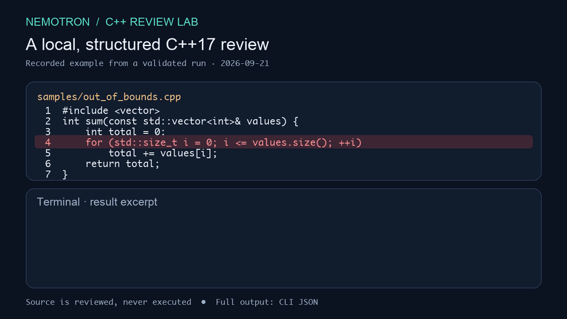

# Nemotron C++ Review Lab

A local, structured C++17 review application and adaptation experiment. It sends source to an OpenAI-compatible model endpoint, validates the returned JSON locally, and measures model behavior against locked source-level benchmarks. Submitted C++ is never executed.

## Demo

[Download the 10-second video](docs/demo.avi). This is a visual recreation of a saved, schema-validated review from September 21, 2026; it shows an excerpt of the real result rather than a live screen recording. [Recreate the animation](docs/DEMO.md).

**Use the visual reviewer:** with your model endpoint running, start `python3 visual_app.py` and open [http://127.0.0.1:8765](http://127.0.0.1:8765). The page lets you edit C++ code and see the live, schema-validated result in a layout based on the demo. See [SETUP.md](SETUP.md#use-the-visual-reviewer) for endpoint options.

## Current result

The V4+V7+V8 adapter composition measured the same strict result on the development and fresh generalization benchmarks:

| Benchmark | Cases | Precision | Recall | Range-overlap recall |
| --- | ---: | ---: | ---: | ---: |
| `eval_v2` development | 12 | 0.667 | 0.800 | 0.900 |
| `eval_v3` generalization | 12 | 0.667 | 0.800 | 0.800 |

Each suite has ten labeled findings and two clean controls. The current model still produces false `bug` findings on clean controls, so these are small engineering measurements rather than production-quality estimates. See [RESULTS.md](RESULTS.md) for the full comparison and limits.

## Read this in order

1. [SETUP.md](SETUP.md) — ordered local setup, review, evaluation, and adaptation reproduction.
2. [REPRODUCIBILITY.md](REPRODUCIBILITY.md) — environment pins, validation commands, and evaluation boundaries.
3. [RESULTS.md](RESULTS.md) — measured benchmark results.
4. [data/README.md](data/README.md) — data-split and provenance policy.

## Repository boundaries

Source, schemas, data definitions, experiment scripts, and documentation are tracked. The repository excludes model weights, adapters, virtual environments, generated MLX datasets, raw request/response logs, local configuration, and macOS metadata. See [PUBLIC_FILE_SCOPE.md](PUBLIC_FILE_SCOPE.md) for the exact initial-commit scope.

## Status

Phases 0–3 are complete: application build, baseline evaluation, adaptation, and calibration. Phase 4 measured generalization on a fresh locked suite. The next work is reproducibility and public-project hardening; do not tune further against `eval_v2` or `eval_v3`.
